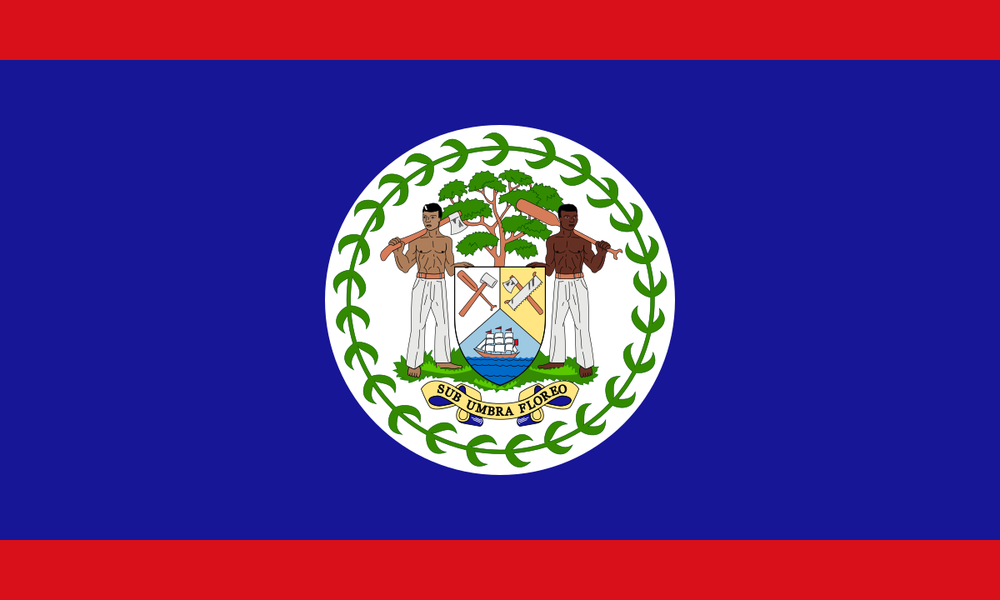

## Belize

Sovereign: Queen Elizabeth II (1952)

Governor-General: Sir Colville Young (1993)

Prime Minister: Dean Barrow (2008)

Land area: 8,803 sq mi (22,800 sq km); total area: 8,867 sq mi (22,966 sq km)

Population (2014 est.): 340,844 (growth rate: 1.9%); birth rate: 25.14/1000; infant mortality rate: 20.31/1000; life expectancy: 68.49

Capital (2011 est.): Belmopan, 14,000

Largest city: Belize City, 52,600

Monetary unit: Belize dollar

Languages: Spanish 46%, Creole 32.9%, Mayan dialects 8.9%, English 3.9% (official), Garifuna 3.4% (Carib), German 3.3%, other 1.4%, unknown 0.2% (2000 census)

Ethnicity/race: mestizo 48.7%, Creole 24.9%, Maya 10.6%, Garifuna 6.1%, other 9.7%

National Holiday: Independence Day, September 21

Literacy rate: 76.9% (2011 est.)

Economic summary: GDP/PPP (2013 est.): $3.083 billion; per capita $8,800. Real growth rate: 2.5%. Inflation: 1.3%. Unemployment: 15.5 % (2013). Arable land: 3.27%. Agriculture: bananas, coca, citrus, sugar; fish, cultured shrimp; lumber; garments. Labor force: 120,500; note: shortage of skilled labor and all types of technical personnel; agriculture 10.2%, industry 18.1%, services 77.7% (2007 est.). Industries: garment production, food processing, tourism, construction. Natural resources: arable land potential, timber, fish, hydropower. Exports: $633 million (2013 est.): sugar, bananas, citrus, clothing, fish products, molasses, wood. Imports: $864 million (2013 est.): machinery and transport equipment, manufactured goods; fuels, chemicals, pharmaceuticals; food, beverages, tobacco. Major trading partners: U.S., UK, Mexico, Guatemala, Cuba, China, Japan, Nigeria, Netherlands, Singapore, Germany (2012).

Member of Commonwealth of Nations
Communications: Telephones: main lines in use: 25,400 (2012); mobile cellular: 164,200 (2012). Broadcast media: 8 privately owned TV stations; multi-channel cable TV provides access to foreign stations; about 25 radio stations broadcasting on roughly 50 different frequencies; state-run radio was privatized in 1998 (2007). Internet hosts: 3,392 (2012). Internet users: 36,000 (2009).

Transportation: Railways: 0 km. Highways: total: 2,870 km; (2011 est.). Waterways: 825 km (navigable only by small craft) (2011). Ports and harbors: Belize City, Big Creek. Airports: 47 (2013 est.).

International disputes: Guatemala persists in its territorial claim to half of Belize, but agrees to the Line of Adjacency to keep Guatemalan squatters out of Belize's forested interior; both countries agreed in April 2012 to hold simultaneous referenda, which was scheduled for 6 October 2013, to decide whether to refer the dispute to the ICJ for binding resolution, though this has been suspended indefinitely; Belize and Mexico are working to solve minor border demarcation discrepancies arising from inaccuracies in the 1898 border treaty.

Geography
Belize is situated on the Caribbean Sea, south of Mexico and east and north of Guatemala in Central America. In area, it is about the size of New Hampshire. Most of the country is heavily forested with various hardwoods. Mangrove swamps and cays along the coast give way to hills and mountains in the interior. The highest point is Victoria Peak, 3,681 ft (1,122 m).

Government
Parliamentary democracy within the British Commonwealth.

History
The Mayan civilization spread into the area of Belize between 1500 B.C. and A.D. 300 and flourished until about 1200. Several major archaeological sites—notably Caracol, Lamanai, Lubaantun, Altun Ha, and Xunantunich—reflect the advanced civilization and much denser population of that period. European contact began in 1502 when Columbus sailed along the coast. The first recorded European settlement was begun by shipwrecked English seamen in 1638. Over the next 150 years, more English settlements were established. This period was also marked by piracy, indiscriminate logging, and sporadic attacks by Indians and neighboring Spanish settlements. Both Spain and Britain lay claim to the land until Britain defeated the Spanish in the battle of St. George's Cay (1798). It became a colony of Great Britain in 1840, known as British Honduras, and a Crown colony in 1862. Full internal self-government was granted in Jan. 1964. In 1973, the country changed its name to Belize.

Belize became independent on Sept. 21, 1981. But Guatemala, which had made claims on the territory since the 1800s, refused to recognize it. British troops remained in the country to defend it. Although the dispute between Guatemala and Great Britain remained unresolved, Guatemala recognized Belize's sovereignty in Sept. 1991. Guatemala, however, still claims more than half of Belize’s territory.

Prime Minister Said Musa was reelected to a second term in 2003. Musa promised to improve conditions to the largely underdeveloped, southern part of Belize.

